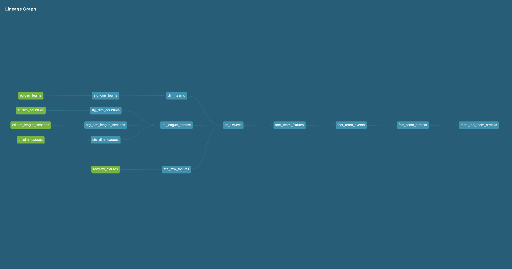

# ⚽ Football Streaks Analytics Pipeline

An end-to-end data pipeline that transforms raw football fixture data into streak-based analytics to support betting insights.  
The goal is to identify team consistency patterns across different betting event types and use those streaks as performance indicators for predictive modeling.

---

## 🧠 Overview

The main goal of this project is to **track team performance streaks for betting insights**.  
All events monitored are actual betting events from **SportyBet.com**.

The pipeline aims to uncover what each team is consistently good or bad at — scoring, conceding, keeping clean sheets, or maintaining win streaks.  
These consistency measures can then be used as **expected values** in probability or betting analysis.

In future development, team performance rates and streak consistency will serve as **weights** for evaluating expected outcomes.  
A further research direction is exploring **embeddings**, where teams’ performances are represented in a vector space.  
For example:

> If Team A consistently scores and Team B consistently concedes, can embeddings capture their similarity — suggesting a high chance of Team A scoring again?

While football outcomes are inherently volatile, this experiment explores how far structured streak analysis and embeddings can go in improving predictability.

---

## 🛠 Tech Stack

- **Backend:** Python  
- **Transformation:** dbt  
- **Data Storage:** PostgreSQL  
- **Orchestration:** Apache Airflow  
- **Infrastructure:** Docker  
- **Deployment:** Vercel (for hosting related assets)  
- **Other Tools:** Redis (planned), GitHub Actions (planned CI/CD)

---

## 🗺️ Architecture

### ⚙️ Metadata Bootstrap (Manual Workflow)

```bash
metadata.yaml → extract_metadata.py → extract_fixtures.py → transform_fixtures.py → load_fixtures.py
```
-	Bootstraps countries, leagues, and team data.
-	Currently manually run, but planned to be integrated into a triggered Airflow DAG.
-	transform_fixtures.py was originally used for ETL consistency but will be deprecated — dbt now fully handles transformations.

### 🔁 Airflow DAG (Automated Fixture Updates)

```bash
update_fixtures → transform_fixtures → load_updates → dbt_run
```
-	Scheduled updates for new match fixtures.
-	Ensures data consistency and refreshes team performance models.
- Transformations are incremental and handled by dbt.

**Lesson Learned:** Don’t force “ETL” structure where it’s unnecessary — use the right tool for each part of the process.
dbt proved more efficient than maintaining a separate transform script.

## 🧩 Data Modeling with dbt
The dbt models handle all transformations from raw fixtures to analytics-ready marts.

### 🔄 Lineage Flow

**Upstream Sources:**
	-	etl.dim_teams
	-	etl.dim_countries
	-	etl.dim_league_seasons
	-	etl.dim_leagues
	-	raw.raw_fixtures

**Transformation Layers:**
	-	stg_* models clean and prepare data
	-	int_* models join contextual info (league, season, country)
	-	fact_* models build event-level and team-level aggregations
	-	mart_* models produce final analytics tables

## 🧠 Final Output Model: mart_top_team_streaks

This model exposes team-level streak data used for analysis.



### ✅ Logic Overview:

- Uses `LAG()` to detect when an event switches from false → true  
- Assigns a `GROUP_ID` when a streak begins  
- Tracks the streak length via **run-length encoding** until the event resets  
- Captures **ongoing and completed streaks** with event-based granularity  

---

### 🎯 Event Categories:

#### Result-Based:
- `win`  
- `draw`  
- `loss`

#### Goal-Based:
- `score_1goal`  
- `cleansheet`  
- `goalless`

#### Special:
- `win_or_draw`  
- `concede_2plus`

## 🧪 Running Locally
``` bash
# Clone the repository
git clone https://github.com/yourusername/football-streaks-pipeline.git
cd football-streaks-pipeline

# Spin up services
docker-compose up --build

# Manual metadata bootstrap (optional)
python src/extract_metadata.py
python src/extract_fixtures.py
python src/transform_fixtures.py
python src/load_fixtures.py

# Airflow handles the recurring fixture update and dbt transformation
```
## 🧮 Example Output
[Top Streaks](images/screenshot.png)


## 🚧 Roadmap
	-	Airflow-triggered DAG for new league ingestion
	-	Redis caching for faster team metadata lookups
	-	CI/CD pipeline (GitHub Actions)
	-	Pagination for API responses
	-	dbt marts for team statistics and head-to-head metrics
	-	Full removal of transform_fixtures.py (dbt-exclusive transformations)

  ## 🔗 Links
	-	📘 LinkedIn Project Posts: www.linkedin.com/in/ayomide-abass-36b40025a
	-	📄 dbt Docs: (coming soon)
	-	💻 Repository: GitHub - https://github.com/ayoabass777/football-stats-pipeline
